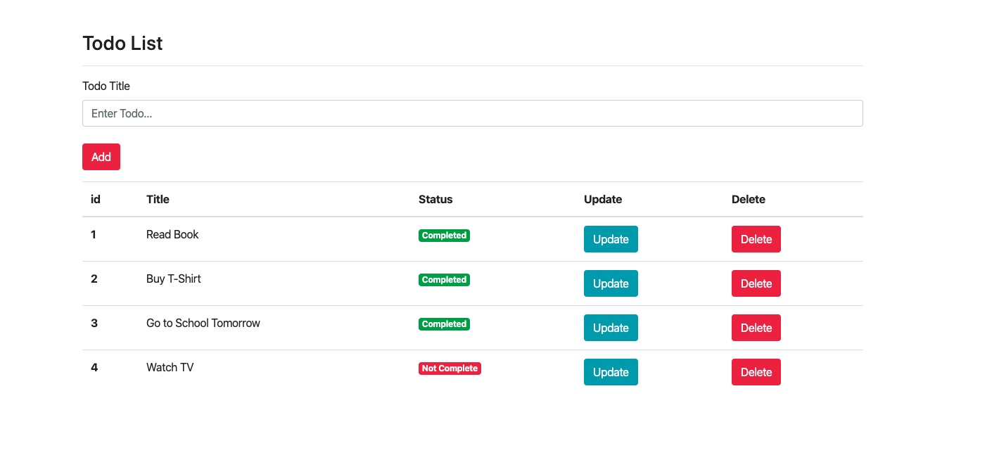

### Simple Flask Todo App




#### PATH 1 (Run directly in local machine)
<hr>

- Create python3 virtual environment and activate it (python3 -m venv venv)
- Run 'pip install -r requirements.txt' on terminal
- Run app.py on terminal for start local server

<hr>


#### PATH 2 (Run in local machine using Docker)

```bash

# To build and push the images [Skip if already done]
docker build --rm -t techierishi/pytodo:latest .
docker login -u techierishi
docker push techierishi/pytodo

# To see the images
docker images

# To run the container
docker run -d -p 5001:5000 --name pytodo-container techierishi/pytodo:latest

# Open following URL in browser
http://127.0.0.1:5001/

# Clean up
docker rm $(docker stop pytodo-container) && docker rmi --force techierishi/pytodo:latest


```

<hr>

#### PATH 3 (Run in local k8s cluster using `kind`)

```bash

# Install kind for creating k8s cluster. Docker is prerequisite. [Skip if done]
brew install kind

# Create cluster
kind create cluster --name pytodo-cluster 

# Set context
kubectl config set-context pytodo-cluster  
kubectl cluster-info --context pytodo-cluster

# To get cluster nodes
kubectl get nodes

# Deploy yamls
kubectl apply -f cicd/yamls/config.yaml
kubectl apply -f cicd/yamls/webapp.yaml

# To get pods in cluster
kubectl get pods
kubectl describe pod <pod-name>
kubectl logs <pod-name> 

# Expose service to host machine
kubectl port-forward service/pytodo-service 5001:5000

# Open following URL in browser
http://127.0.0.1:5001/

# Delete cluster
kind delete cluster --name pytodo-cluster 
```
<hr>

#### PATH 4 (CI-CD using Jenkins)
